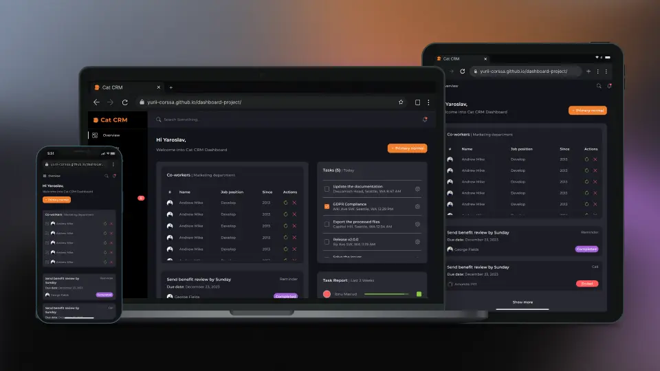

# Cat CRM Dashboard

> Welcome to the Cat CRM Dashboard project! This project is a sleek, user-friendly dashboard page for Cat CRM, designed with the aim of practicing and showcasing the capabilities of the Sass preprocessor.



## Description

**The Cat CRM Dashboard** project represents a personal journey into the depths of Sass (Syntactically Awesome Stylesheets), crafted as a solo endeavor to solidify my understanding and application of this powerful CSS preprocessor. The dashboard serves not just as a tool for managing a whimsical Cat CRM system, but as a canvas on which I've practiced and honed my Sass skills.

Conceived from a desire to transform theoretical knowledge into practical expertise, this project allowed me to explore Sass's robust features — variables, mixins, nesting, and beyond. The process was as much about creating a dynamic, responsive user interface for the dashboard as it was about embedding the principles of scalable and maintainable CSS through Sass's advanced functionalities.

This project stands as a milestone in my web development journey, reflecting my dedication to mastering Sass. It showcases the nuanced capabilities of Sass in enhancing CSS with programmable logic, thus opening up new horizons in styling methodologies.

## Features

- **Responsive Design** - Crafted with mobile-first principles in mind, ensuring an optimal user experience across all devices.
- **Sass Powered** - Utilizes the power of Sass (SCSS syntax) for styling, employing variables, mixins, and functions for efficient, maintainable CSS.
- **Custom Components** - From buttons to notification badges, all UI components are custom-styled, demonstrating the flexibility of Sass.
- **Efficient Workflow** - Leveraging Vite for a fast development server and optimized build, including image optimization for improved performance.

## Technology Stack

- **HTML5** - Semantic markup for structuring content.
- **SCSS** - Advanced CSS with variables, nesting, and more.
- **JavaScript** - Enhancing interactivity and functionality.
- **Vite** - Frontend tooling for development and production builds.

## Getting Started

To run this project locally, you need to have `node` and `npm` installed.

1. Clone the repository:

   ```bash
   git clone https://github.com/yurii-corssa/dashboard-project.git
   cd dashboard-project
   ```

2. Install the dependencies:

   ```bash
   npm install
   ```

3. Run the project:

   ```bash
   npm run dev
   ```

## Contributing

Contributions are welcome! Feel free to create a pull request to suggest improvements or new features.

## License

This project is open source and available under the [MIT License](LICENSE).
